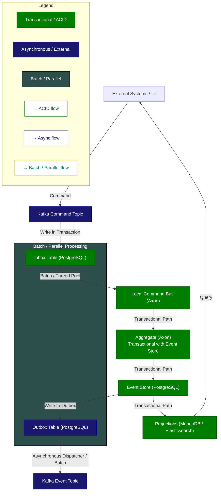

# Quincunx Banking Platform Architecture

This document describes the architecture of the Quincunx Banking Platform based on **Domain-Driven Design (DDD)**, **Event Sourcing**, and **CQRS**.

---

## 1️⃣ Overview

The platform is designed as a set of **microservices**, connected through **Kafka** for commands and events, with **PostgreSQL** as the transactional Event Store and **MongoDB / Elasticsearch** for read models (projections).

**Key principles:**

- **Transactional data (ACID)** in PostgreSQL
- **Asynchronous communication** via Kafka
- **Read models (projections)** stored in MongoDB and Elasticsearch
- **Batch / parallel processing** for Inbox/Outbox patterns
- **CQRS and Event Sourcing** at the core

---

## 2️⃣ Component Diagram

---

## 3️⃣ Components Description

| Component | Technology | Purpose |
|-----------|------------|---------|
| **PostgreSQL** | Postgres 16 | Transactional Event Store, Inbox/Outbox tables |
| **MongoDB** | MongoDB 7 | Projections / Read Models for fast queries |
| **Elasticsearch** | Elasticsearch 8 | Search / analytics projections |
| **Kafka / Zookeeper** | Confluent Kafka 7.4 | Command and Event transport |
| **Axon Framework** | Java / Spring Boot | Local command bus, aggregates, event sourcing |
| **UI / External Systems** | Angular / React / any | Sends commands, queries projections |
| **Inbox Table** | PostgreSQL | Ensures transactional command processing |
| **Outbox Table** | PostgreSQL | Sends events asynchronously to Kafka |
| **Batch / Thread Pool** | Java Executor / Axon | Parallel processing of inbox/outbox |

---

## 4️⃣ Data Flow

1. **Command flow (Transactional / ACID)**
    - UI or external system sends a command to Kafka.
    - Kafka writes the command into **Inbox Table** (PostgreSQL) in a transaction.
    - Local Command Bus picks up commands from Inbox and applies them to **Aggregates**.
    - Aggregates write **Events** to **Event Store** (PostgreSQL).
    - **Projections** are updated asynchronously in MongoDB/Elasticsearch.

2. **Event flow (Asynchronous)**
    - Event Store writes to **Outbox Table**.
    - Outbox Dispatcher reads events and publishes them to Kafka topics.
    - Other microservices (or UI) subscribe to relevant events asynchronously.

3. **Query flow (Read models / CQRS)**
    - UI queries projections in MongoDB or Elasticsearch.
    - Provides fast and optimized access for read operations.

---

## 5️⃣ Databases and Schemas

### PostgreSQL

- **Database:** `quincunx-event-store`
- **Schemas / Tables:**
    - `events` → aggregates events
    - `inbox` → transactional commands
    - `outbox` → events for asynchronous delivery

### MongoDB

- **Database:** `projections`
    - Collections: `payments`, `notifications`, `analytics`
- **Database:** `files`
    - Used with **GridFS** for file storage

### Elasticsearch

- Indexes for **analytics and search projections**.

---

## 6️⃣ Key Patterns

- **Inbox / Outbox:** Ensures transactional integrity when moving between ACID and async domains.
- **Event Sourcing:** All changes stored as immutable events in PostgreSQL.
- **CQRS:** Read models optimized for querying stored separately from transactional writes.
- **Batch / Parallel Processing:** Ensures scalability for Inbox/Outbox tables.

---

## 7️⃣ Monitoring & Tools

| Tool | Purpose |
|------|---------|
| **Kafka UI** | Inspect Kafka topics, producers, consumers |
| **pgAdmin** | Manage PostgreSQL, inspect Event Store / Inbox / Outbox |
| **mongo-express** | Inspect MongoDB collections (projections, files) |
| **Kibana** | Visualize Elasticsearch projections |
| **Prometheus / Grafana** | Metrics collection and visualization |
| **Exporters** | Postgres, Mongo, Kafka, Zookeeper, Elasticsearch metrics |

---

## 8️⃣ Summary

This architecture separates **transactional processing** from **read projections** and **asynchronous event delivery**, ensuring:

- ACID compliance for critical operations
- Fast, scalable read access via projections
- Event-driven communication between microservices
- Easy observability and monitoring

It is suitable for a **banking platform** or any financial system requiring strict transactional integrity and auditability.  
