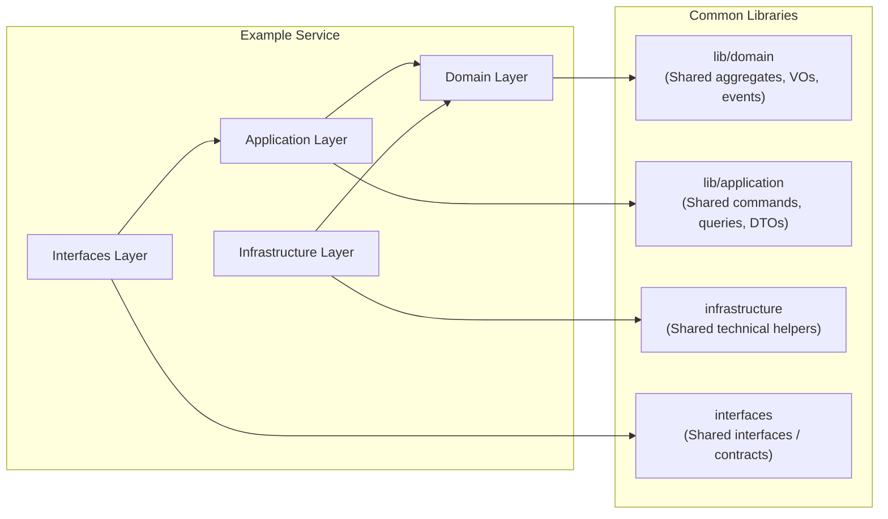

# Libraries Style Guide

This guide describes **how to structure and maintain common libraries** (`libs/core`, `libs/infrastructure`, `libs/interfaces`) that are shared between microservices.  
All developers should follow this guide to ensure consistency and proper DDD practices.

---

## Project Structure

The recommended structure for common libraries:

```
libs/
├─ domain/          # Shared aggregates, VOs, events
│  ├─  aggregate/   # Aggregates for multiple services
│  ├─  model/       # Entities / Value Objects
│  └─  event/       # Domain Events
│
├─ application/     # Shared commands, queries, DTOs
│  ├─  command/     # Shared commands
│  ├─  query/       # Shared queries
│  └─  dto/         # Shared DTOs for inter-service communication
│
├─ infrastructure/  # Shared technical helpers
│  ├─  mongo/       # Mongo converters, serializers, helpers
│  ├─  elastic/     # Elasticsearch helpers
│  ├─  ...
│  └─ util/         # Serializers, converters, common utils
│
├─ interfaces/      # Shared interfaces / contracts
│  ├─ messaging/    # Kafka / event bus contracts
   └─ api/          # REST, gRPC, GraphQL interfaces
```

---

## Layer Responsibilities

### Domain Layer (`libs/domain`)
- Shared **Value Objects (VO)**, e.g., `PaymentId`, `Amount`, `Currency`, `UserId`
- Cross-service **Domain Events**
- **No dependencies** on Spring, Axon, Kafka

### Application Layer (`libs/application`)
- Cross-service **Commands**, **Queries**, **DTOs**
- Used by multiple microservices to maintain **consistent contracts**
- Immutable objects and proper versioning for events

### Infrastructure Layer (`libs/infrastructure`)
- Technical utilities for projections, messaging, or database helpers
- Example: Mongo converters, Elasticsearch serializers

### Interfaces Layer (`libs/interfaces`)
- Abstract interfaces for messaging or API contracts
- Ensures services depend only on contracts, not implementations

---

## Layered Dependency Diagram



---

## Guidelines for Developers

1. **Follow the folder structure** strictly.
2. **Domain layer** in common libs must remain **framework-agnostic**.
3. **Application layer** contains only cross-service commands, queries, DTOs.
4. **Infrastructure layer** is optional, only for technical helpers.
5. **Interfaces layer** defines abstract contracts; services implement them.
6. **Events, Commands, DTOs** must be immutable. Use versioning when modifying.
7. Keep **local, service-specific events/commands** inside the service, not in common libs.
8. Document flows and dependencies with **Mermaid diagrams** for clarity.

---

## Examples

### Shared Value Object (VO)

- VO are **immutable objects** representing domain concepts.
- They encapsulate **validation and domain rules**.
- Use VOs in commands, events, and aggregates instead of primitive types.

```kotlin
data class PaymentId(override val value: String) : StringValue
```

### Shared Command

```kotlin
data class CreatePaymentCommand(
    val paymentId: PaymentId,
    val amount: Amount,
    val currency: Currency,
    val userId: UserId
)
```

### Shared Data Transfer Object (DTO)

```kotlin
data class PaymentStatusDto(
    val paymentId: PaymentId,
    val status: PaymentStatus
)
```

---

## Summary

- Enforces consistent DDD layers in shared libraries.
- Separates cross-service contracts from service-local logic.
- Developers have a clear template for adding new common components.
- Supports integration with Spring Boot, Kotlin, Axon, Kafka, MongoDB, Elasticsearch.

