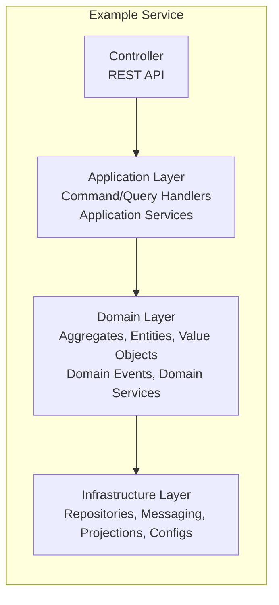
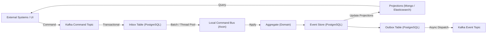

# Services Style Guide

This guide describes the **recommended structure and development practices** for all microservices in the platform.  
Every developer should follow these rules when creating or maintaining a service.
---

## Project Structure

```
example-service/
├─ src/main/kotlin/org/xankremi/quincunx/example/
│  ├─ application/         # Application Layer
│  │  ├─ command/          # Command Handlers
│  │  ├─ query/            # Query Handlers (CQRS)
│  │  ├─ service/          # Application Services / Sagas
│  │  └─ dto/              # DTOs for API or inter-service communication
│  │
│  ├─ domain/              # Domain Layer
│  │  ├─ aggregate/        # Aggregates (Axon)
│  │  ├─ event/            # Domain Events
│  │  ├─ model/            # Entities / Value Objects
│  │  ├─ repository/       # Repository Interfaces (Spring Data)
│  │  └─ service/          # Domain Services (business logic)
│  │
│  ├─ infrastructure/      # Infrastructure Layer
│  │  ├─ config/           # Spring, Axon, Kafka, Persistence configs
│  │  ├─ projection/       # Mongo / Elasticsearch projections
│  │  ├─ messaging/        # Kafka producers / consumers
│  │  └─ util/             # Converters, serializers, helpers
│  │
│  └─ interfaces/          # External Interfaces (REST, gRPC, GraphQL, messaging APIs)
│
└─ resources/
   ├─ application.yml
   └─ logback.xml
```

---

## Layer Responsibilities

### **Domain Layer**
- Core business logic (framework-agnostic)
- Aggregates, Entities, Value Objects
- Domain Events
- Domain Services
- Repository Interfaces (Spring Data)  
  **Note:** No implementation required for Spring Data repositories; Spring generates them automatically.

### **Application Layer**
- Coordinates domain operations (use cases)
- Command / Query handlers
- Application services / Sagas
- DTOs for input/output

### **Infrastructure Layer**
- Technical layer: external systems, DB, messaging
- Concrete repository implementations (if custom methods required)
- Projections to Mongo / Elasticsearch
- Kafka producers / consumers
- Configuration and utilities (serializers, converters)

### **Interfaces Layer**
- REST, gRPC, GraphQL endpoints
- Messaging APIs
- Calls application layer, never domain directly

---

## Layered Architecture Diagram



---

## Command / Event Flow



- **Green arrows** → ACID / transactional flow
- **Blue arrows** → Asynchronous / external flow
- **Gold arrows** → Batch / parallel processing

---

## Guidelines for Developers

1. **Follow the folder structure** strictly when creating new microservices.
2. **Domain layer** contains **all business logic**; no Spring or framework dependencies.
3. **Application layer** orchestrates domain operations and handles commands/queries.
4. **Infrastructure layer** is only for technical implementation (DB, messaging, projections).
5. **DTOs** go only in `application/dto`; never pass them into domain objects.
6. **Projections** update read models in `infrastructure/projection`.
7. **Events and Commands** should be immutable. Use versioning if modified.
8. **Repositories**: place interfaces in domain; only implement in infra if needed.
9. Ensure **ACID paths** are isolated from **async / batch flows**.
10. Always use **Mermaid diagrams** in documentation to illustrate flow for new services.

---

## Summary

- Enforces **DDD, CQRS, Event Sourcing best practices**.
- Testable, maintainable, and framework-agnostic domain.
- Developers have a **clear template** for adding new microservices.
- Supports integration with Spring Data, Axon, Kafka, MongoDB, Elasticsearch.  
